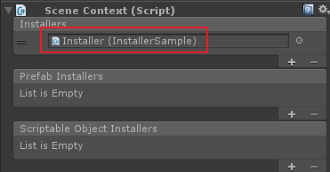
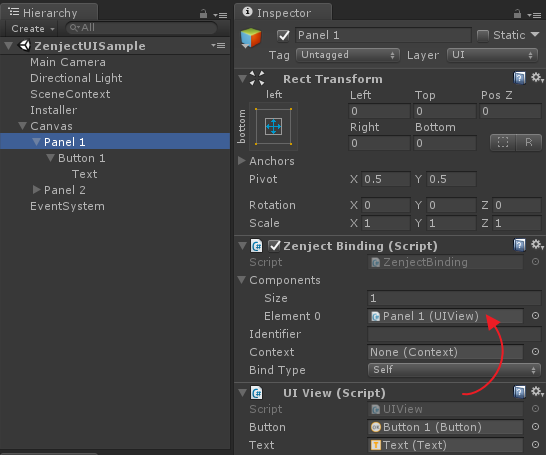

# UI

여기에서는 Zenject를 사용하여 uGUI 버튼 객체의 참조와 관련한 종속성을 처리하는 방법에 대해서 다룬다.


## Context 생성

SceneContext 컴포넌트를 가지는 GameObject를 생성한다.

## Installer 생성

*'Installer'(설치자)* 란 바인딩을 재사용하기 용이하도록 객체화한 것이다. `Installer` 혹은 `MonoInstaller` 클래스를 상속한 클래스를 정의한 다음 *'InstallBindings'* 함수를 재정의해서 필요한 바인딩을 정의한다.

> MonoBehaviour처럼 GameObject의 컴포넌트로 사용할 인스톨러가 필요한 경우에는 MonoInstaller를 상속하고 그렇지 않은 경우에는 Installer를 상속한다.

``` csharp
using System;
using Zenject;

public class InstallerSample : MonoInstaller<InstallerSample>
{
    public override void InstallBindings()
    {
        Container.Bind<ZenjectSample>().AsSingle();
        Container.Bind<IInitializable>().To<ZenjectSample>().AsSingle();
        Container.Bind<IDisposable>().To<ZenjectSample>().AsSingle();
    }
}
```

## Context에 Installer 연결

*Installer* 는 *Context* 에 연결해 주어야 한다. SceneContext를 생성한 다음 여기에
InstallerSample을 연결하도록 한다.

<p align="center">
  
</p>

## ZenjectBinding을 이용한 UI 객체 등록

``` csharp
using UnityEngine;
using UnityEngine.UI;
using UniRx;

public class UIView : MonoBehaviour
{
    [SerializeField]
    Button button;

    [SerializeField]
    Text text;

    public IObservable<string> OnClickObservable()
    {
        return button.OnClickAsObservable().Select(_ => text.text);
    }
}
```

<p align="center">
  
</p>

## 의존성 주입

``` csharp
using System;
using System.Collections.Generic;
using UniRx;
using Zenject;

public class ZenjectSample : IInitializable, IDisposable
{
    [Inject]
    List<UIView> buttons;

    List<IDisposable> subscriptions = new List<IDisposable>();

    void IInitializable.Initialize()
    {
        UnityEngine.Debug.Log("Initialize");

        buttons.ForEach(button =>
        {
            subscriptions.Add(button.OnClickObservable().Subscribe(text => OnClick(text)));
        });
    }

    void OnClick(string buttonText)
    {
        UnityEngine.Debug.Log(buttonText);
    }

    public void Dispose()
    {
        subscriptions.ForEach(subscription => subscription.Dispose());
        subscriptions.Clear();

        UnityEngine.Debug.Log("Dispose");
    }
}
```
